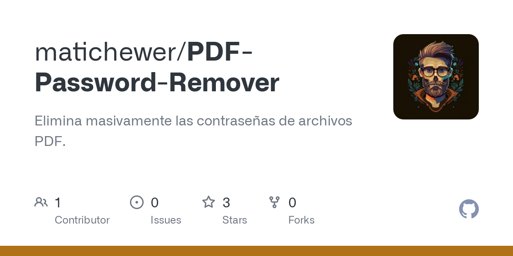

# Github Previews

Get github repositories previews.


## Usage
Open in your browser the next link

```
https://github-preview.onrender.com/ < git user > / < repo name > 
```


### Example
Go to
```
https://github-preview.onrender.com/matichewer/PDF-Password-Remover
```
And you get something like this:
```
{
    "title":"GitHub - matichewer/PDF-Password-Remover: Elimina masivamente las contraseñas de archivos PDF.",
    "description":"Elimina masivamente las contraseñas de archivos PDF. - matichewer/PDF-Password-Remover", 
    "imageUrl":"https://opengraph.githubassets.com/56325fc290934e48aaa1b65d1ee7d4f904ef3aa46b3e0e5eec3607d09a6d3129/matichewer/PDF-Password-Remover"
}
```

The link in the parameter 'imageUrl' is the next image:
<p align="center">
  
</p>

---

## Deploys
- https://github-preview.onrender.com
- https://github-preview.chewer.net

---
  
## Run locally
### Download
```
git clone https://github.com/matichewer/github-preview
cd github-preview/
```
### Create a .env file with:
```
HOST_NAME=0.0.0.0
PORT=3000
```

### Start
#### With docker
```
docker compose up -d
```

#### With npm
Install dependencies
```
npm install
```
Run in production
```
npm start
```

Run in dev
```
npm run dev
```
And you can test it:

http://localhost:3000/matichewer/PDF-Password-Remover

